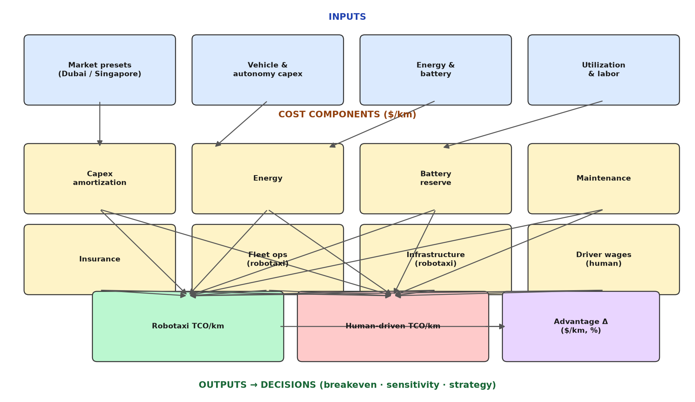
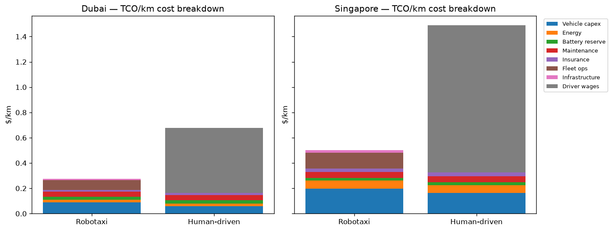
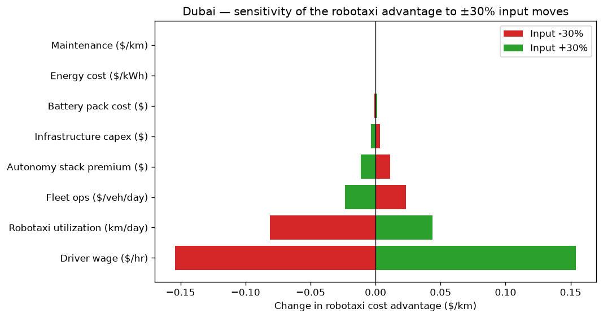

# Autonomous Fleet vs. Traditional Fleet TCO Calculator

A Python model evaluating **Total Cost of Ownership (TCO) per kilometer** for **robotaxi fleets vs. human-driven ride-hailing** in high-density markets — with Dubai and Singapore presets.

> All numbers below are produced by the executed notebook in this repo from **illustrative modelling assumptions**, not market quotes. Calibrate with local data before any commercial use.

## Key Insights for Decision Makers

- **Situation:** High-density markets are the natural launchpad for robotaxi fleets, but the investment case is usually argued on technology cost curves. **Complication:** In this model, technology is not the binding constraint — in Dubai the robotaxi costs **$0.28/km vs $0.68/km human-driven (59% cheaper)**, and in Singapore **$0.50/km vs $1.49/km (66% cheaper)**, driven overwhelmingly by eliminating the driver wage bill. **Resolution:** Evaluate robotaxi deployments as a *labor-arbitrage* investment first and a technology investment second; rank launch markets by driver-wage levels and achievable utilization, not by energy tariffs.
- **Situation:** Skeptics argue autonomy only pays at extreme utilization. **Complication:** The model finds the robotaxi fleet cheaper at *every* utilization from 50–600 km/day in both markets — driver wages would need to collapse to **~$2.00/hr (Dubai) / ~$2.42/hr (Singapore)** before human-driven breaks even, below any plausible labor market. **Resolution:** Deployment risk is execution risk (fleet uptime, remote-operations cost control), not demand-density risk — underwrite operations, not ridership forecasts.
- **Situation:** Battery durability and charging infrastructure dominate industry debate. **Complication:** In the model they are second-order: the battery-replacement reserve is **$0.026/km (9% of robotaxi TCO)**, and halving depot/charging capex saves only **$0.006/km** (infrastructure is 4% of TCO). **Resolution:** For OEMs and operators, the levers that move the P&L are autonomy-stack cost ($25k/vehicle in the model) and fleet-ops discipline — not pack longevity or shared charging hubs.

## Live demo

[](https://share.streamlit.io)

No live deployment is hosted yet — deploy `app.py` yourself in one click on Streamlit Community Cloud:

1. Go to [share.streamlit.io](https://share.streamlit.io) and sign in with GitHub.
2. Click **New app** → select this repository (`HemanthMChakravarthy/autonomous-fleet-tco-calculator`).
3. Set the main file path to `app.py` → **Deploy**.

Local run: `pip install -r requirements.txt && streamlit run app.py`

The app offers Dubai / Singapore / Custom presets with sliders for utilization, driver wage, energy cost, autonomy-stack premium, battery pack cost, and infrastructure capex — plus TCO comparison, cost-breakdown, and breakeven charts.

## Visuals

**Model architecture** — inputs → cost components → TCO/km outputs → decisions:



**TCO/km cost breakdown, Dubai vs Singapore:**



**Sensitivity of the robotaxi advantage (±30% inputs, Dubai):**



More charts (utilization breakeven sweep) are in the notebook.

## Methodology (summary)

Per-km cost over an 8-year vehicle life, capex amortized with a capital-recovery factor (8% discount rate):

| Component | Robotaxi | Human-driven |
|---|---|---|
| Vehicle capex (base EV + autonomy premium + COE) | ✓ | ✓ (no autonomy premium) |
| Energy (kWh/km × A/C-heat penalty × $/kWh) | ✓ | ✓ |
| Battery-degradation reserve (linear fade, heat-adjusted; pack replaced below 70% capacity) | ✓ | ✓ |
| Maintenance & tires ($/km) | ✓ | ✓ |
| Insurance ($/yr ÷ annual km) | ✓ | ✓ |
| Fleet ops: cleaning, remote assistance, dispatch ($/veh/day) | ✓ | — |
| Depot + charging infrastructure capex | ✓ | — |
| Driver wages ($/hr × service hrs/day ÷ km/day) | — | ✓ |

Key model functions (`src/tco_model.py`): `tco_per_km()`, `cost_breakdown()`, `breakeven_utilization()`, `breakeven_driver_wage()`, `sensitivity()`.

Headline model outputs (from the executed notebook):

| Market | Robotaxi $/km | Human-driven $/km | Advantage |
|---|---|---|---|
| Dubai | 0.276 | 0.676 | $0.400/km (59% cheaper) |
| Singapore | 0.501 | 1.489 | $0.987/km (66% cheaper) |

Driver wages alone are $0.514/km in Dubai (76% of human-driven TCO) and $1.16/km in Singapore — the single largest line item in both markets.

## Strategic & Commercial Implications for OEMs / Mobility Operators

(from the notebook's closing analysis, computed from model outputs)

1. **The robotaxi business case is a labor-arbitrage case** — lead with wage economics, not sensor-cost roadmaps.
2. **The advantage is structurally robust** — wages at ~$2/hr breakeven; sensitivity confirms driver wage moves the advantage by $0.31/km (~77% of the Dubai edge).
3. **Utilization is the second lever, not the first** — cheaper at all utilization levels; underwrite operational execution.
4. **Battery degradation is second-order** — $0.026/km; doubling pack cost moves TCO by cents.
5. **Infrastructure sharing barely moves the math** — $0.006/km saved by halving infra capex; prioritize autonomy-stack cost and fleet-ops discipline.
6. **Market selection beats technology timing** — Singapore's COE inflates capex for both fleets, yet the robotaxi advantage is larger there ($0.99/km vs $0.40/km) because the wage arbitrage is bigger.

## Repository structure

```
├── app.py                  # Streamlit interactive demo
├── src/tco_model.py        # Importable TCO model (dataclasses + functions)
├── notebooks/
│   └── autonomous_fleet_tco.ipynb   # Fully executed analysis notebook
├── assets/                 # Architecture diagram + charts
├── requirements.txt
└── LICENSE                 # MIT
```

## Run it

```bash
pip install -r requirements.txt
# notebook
jupyter nbconvert --to notebook --execute notebooks/autonomous_fleet_tco.ipynb --output /tmp/tco_out.ipynb
# or the interactive app
streamlit run app.py
```

## License

MIT — see [LICENSE](LICENSE).
